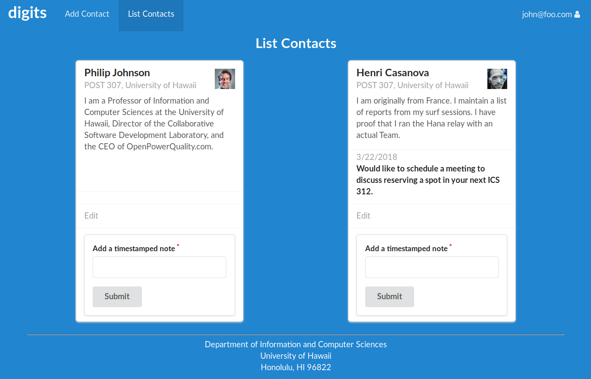

# Digits Web Application

This web app allows users to:

- Create a password protected user account
- Add and manage a set of contacts associated with a user account
- Add timestamped notes associated with each contact

## Installation

**What you need to run this application:**
- [node.js & npm](https://www.npmjs.com/get-npm)
- [meteor](https://www.meteor.com/install)

**Step #1**
Get [a copy of digits](https://github.com/michaelkurihara/digits). __Note, digits is stored in a private repository, so you will need to request permission to gain access.__

**Step #2**
Using your CLI, cd into the digits' `app` folder and install the required libraries using the following command:
```bash
meteor npm install
```

**Step #3**
After all the required libraries have been installed, start the application by running the following command:
```bash
meteor npm run start
```
After you execute the `meteor npm run start` command, the following output should appear in your terminal:
```bash
> meteor-application-template-react@ start /home/spacegg/github/michaelkurihara/techfolio/digits/app
> meteor --no-release-check --settings ../config/settings.development.json

[[[[[ ~/github/michaelkurihara/techfolio/digits/app ]]]]]

=> Started proxy.                             
=> Started MongoDB.                           
I20180322-01:41:03.572(-10)? Creating the default user(s)
I20180322-01:41:03.602(-10)?   Creating user admin@foo.com.
I20180322-01:41:03.603(-10)?   Creating user john@foo.com.
W20180322-01:41:03.603(-10)? (STDERR) Note: you are using a pure-JavaScript implementation of bcrypt.
W20180322-01:41:03.603(-10)? (STDERR) While this implementation will work correctly, it is known to be
W20180322-01:41:03.603(-10)? (STDERR) approximately three times slower than the native implementation.
W20180322-01:41:03.604(-10)? (STDERR) In order to use the native implementation instead, run
W20180322-01:41:03.604(-10)? (STDERR) 
W20180322-01:41:03.604(-10)? (STDERR)   meteor npm install --save bcrypt
W20180322-01:41:03.604(-10)? (STDERR) 
W20180322-01:41:03.604(-10)? (STDERR) in the root directory of your application.
I20180322-01:41:03.790(-10)? Creating default data.
I20180322-01:41:03.790(-10)?   Adding: Johnson (john@foo.com)
I20180322-01:41:03.809(-10)?   Adding: Casanova (john@foo.com)
I20180322-01:41:03.811(-10)?   Adding: Binsted (admin@foo.com)
=> Started your app.

=> App running at: http://localhost:3000/
W20180322-01:45:18.757(-10)? (STDERR) Note: you are using a pure-JavaScript implementation of bcrypt.
W20180322-01:45:18.758(-10)? (STDERR) While this implementation will work correctly, it is known to be
W20180322-01:45:18.758(-10)? (STDERR) approximately three times slower than the native implementation.
W20180322-01:45:18.758(-10)? (STDERR) In order to use the native implementation instead, run
W20180322-01:45:18.758(-10)? (STDERR) 
W20180322-01:45:18.758(-10)? (STDERR)   meteor npm install --save bcrypt
W20180322-01:45:18.758(-10)? (STDERR) 
W20180322-01:45:18.759(-10)? (STDERR) in the root directory of your application.
=> Meteor server restarted
W20180322-09:21:26.727(-10)? (STDERR) Note: you are using a pure-JavaScript implementation of bcrypt.
W20180322-09:21:26.727(-10)? (STDERR) While this implementation will work correctly, it is known to be
W20180322-09:21:26.728(-10)? (STDERR) approximately three times slower than the native implementation.
W20180322-09:21:26.728(-10)? (STDERR) In order to use the native implementation instead, run
W20180322-09:21:26.728(-10)? (STDERR) 
W20180322-09:21:26.728(-10)? (STDERR)   meteor npm install --save bcrypt
W20180322-09:21:26.729(-10)? (STDERR) 
W20180322-09:21:26.729(-10)? (STDERR) in the root directory of your application.
I20180322-09:21:26.903(-10)? Creating default data.
I20180322-09:21:26.903(-10)?   Adding: Basket (john@foo.com)
I20180322-09:21:26.989(-10)?   Adding: Bicycle (john@foo.com)
I20180322-09:21:26.997(-10)?   Adding: Banana (admin@foo.com)
I20180322-09:21:27.006(-10)?   Adding: Boogie Board (admin@foo.com)
```
Hopefully, Meteor will startup the web application, which you can access in your web browser at:
`http://localhost:3000`

** An Important Note About The `bycrpt` Warning **
```bash
W20180322-09:22:06.976(-10)? (STDERR) Note: you are using a pure-JavaScript implementation of bcrypt.
W20180322-09:22:06.977(-10)? (STDERR) While this implementation will work correctly, it is known to be
W20180322-09:22:06.977(-10)? (STDERR) approximately three times slower than the native implementation.
W20180322-09:22:06.977(-10)? (STDERR) In order to use the native implementation instead, run
W20180322-09:22:06.978(-10)? (STDERR) 
W20180322-09:22:06.978(-10)? (STDERR)   meteor npm install --save bcrypt
W20180322-09:22:06.978(-10)? (STDERR) 
W20180322-09:22:06.978(-10)? (STDERR) in the root directory of your application.
```
Unfortunately, installing `bcrypt` and getting it to work properly on certain operating systems like Windows is much harder than just entering the `meteor npm install --save bcrypt` command.  While Meteor uses `bcrypt` for password checking, this error message can be ignored in the development stage.  This issues should be addressed when scaling up the application for high volume usage.

Finally, you can run ESLint to style check the digits program.  You can find the program's ESLint file in the `imports`directory.  Enter the following command to run the style checker:
```bash
meteor npm run lint
```

## User Interface Walk Through

### Landing Page

The application's home page provides a description of the app.  Note the login button in the upper right hand corner of the nav bar.


### Login

By clicking on the login menu option, you can log into the application. You can either create your own user account or take advantage of the two default accounts that come with the program.  All default information can be found in the `settings.development.json` file stored in the program's `config` folder.


### Sign-Up

By using the "Click here to Register" option, you can create your own user account and password.


### User View

After you login, the application will load the user's homepage.  This page looks like the application's homepage with additional nav bar options.


### Add Contact

By clicking the "Add Contact" button, the user can add new contacts to the app's database.  The Add Contact form allows the user to enter the contact's first name, last name, address, a link to an image, and a description.


### User View of Contacts

By clicking the List Contacts option, the user can view the user's contacts stored in the app's database.


### Contact with Timestamped Note Added

The user can add timestamped notes associated with the selected contact.


1
### Edit Contact

By clicking the edit button associated with a specific contact, the user can update that contact's information.


### Admin View of Contacts

All users designated as an administrator have an additional "Admin" nav bar option.  By clicking the "Admin" option, the administrator can view all the contacts stored in the app's database as well as each contact's __owner__.


